# AVASUS

### Projeto REVELA - Desenvolvimento Científico e Tecnológico Aplicado a Sclerose Lateral Amiotrófioca

## 1. Descrição do projeto

O Ambiente Virtual de Aprendizagem do SUS, AVASUS, é uma plataforma que vem auxiliando na transformação do cotidiano da saúde pública brasileira por meio da formação continuada em trabalho. Acesse aqui https://avasus.ufrn.br/.  

Não obstante, o projeto consiste na implementação do front-end de uma plataforma para visualização de módulos educacionais, parceiros e indicadores de transparência pública. A proposta deverá seguir o design system disposto no protótipo de média fidelidade disponibilizado no seguinte endereço: https://bit.ly/laisedital282023. 

## 2. Requisitos do Projeto

Os requisitos transversais obrigatórios são aqueles que deverão ser contemplados na construção das páginas dinâmicas, conforme protótipo de média fidelidade disponibilizado. São eles:

- ### RT#01:

As páginas deverão ser dinâmicas, consumindo os dados da API REST do repositório disponível no seguinte endereço: https://bit.ly/laisedital282023_API. Os serviços disponibilizados na API estão descritos na orientação do README. 

- ### RT#02:

A aplicação web deverá implementar as telas disponíveis no protótipo de média fidelidade acessível no seguinte endereço: https://bit.ly/laisedital282023.  

- ### RT#03:

A utilização de componentes de interface (Tailwindcss, Ant Design, Chakra, Bootstrap,...) será opcional. 

- ### RT#04:

A aplicação proposta deverá ser desenvolvida utilizando componentes por meio da biblioteca React ou Vue.js, ou estática utilizando Django/Laravel Templates. 

- ### RT#05:

Pode ser utilizado frameworks como Next.js, Remix.run, Gatsby, NuxtJS, etc.

- ### RT#06:

As páginas deverão ser responsivas de forma em que imagens, conteúdos, textos e demais elementos visuais se adaptem a qualquer tela em que o usuário estiver conectado, devendo existir ​breakpoints para telas de smartphones, tablets e desktop.

- ### RT#07:

Sempre que possível, deverão ser utilizadas variáveis CSS, seja por meio das variáveis CSS nativas ou por meio dos pré-processadores Sass, LESS, Stylus, styled-components ou equivalentes.

- ### RT#08:

Todos os campos de datas e números recuperados da API devem ser tratados para exibição no padrão brasileiro ou uso para algum cálculo, caso seja necessário. 

## 3. Histórias do usuário

- ### História Usuário #1 - Página Inicial:

#### Após acessar a página inicial da aplicação, desejo visualizar informações sobre os módulos educacionais disponíveis pelo sistema.
 
#### Critérios de aceitação:

- [x] CA#01 Exibir menu de navegação, seção de destaques,seção de listagem de módulos educacionais, seção de parcerias e rodapé com links.

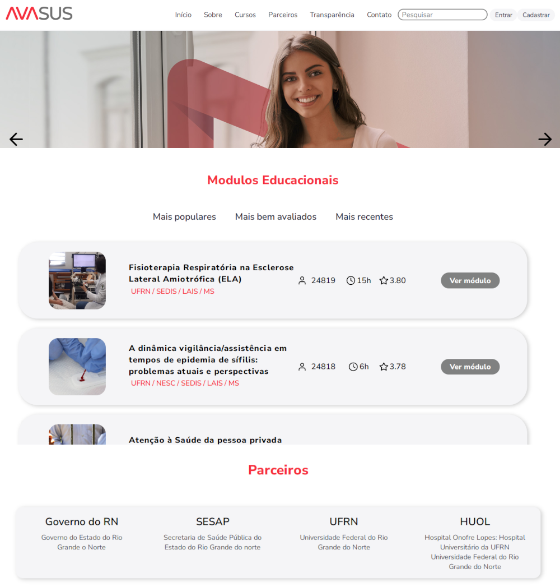

- [X] CA#02 Na seção de listagem de módulos educacionais, mostrar 3 módulos por aba. Os módulos mostrados devem ser recuperados da API.

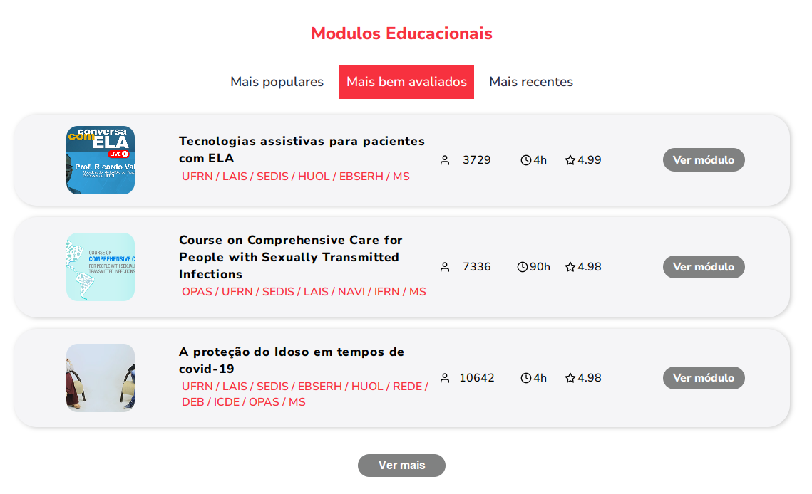

- [x] CA#03: A barra de navegação superior deve ficar fixa no topo ao rolar a página.

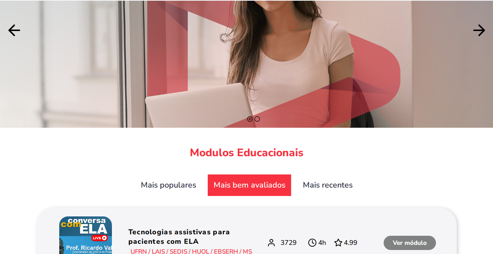

- ### História Usuário #2 - Página de listagem de módulos educacionais:

#### Poder visualizar a listagem de todos os módulos educacionais disponveis pelo sistema.

#### Critérios de aceitação:

- [x] CA#01: Separar os módulos educacionais por categoria.

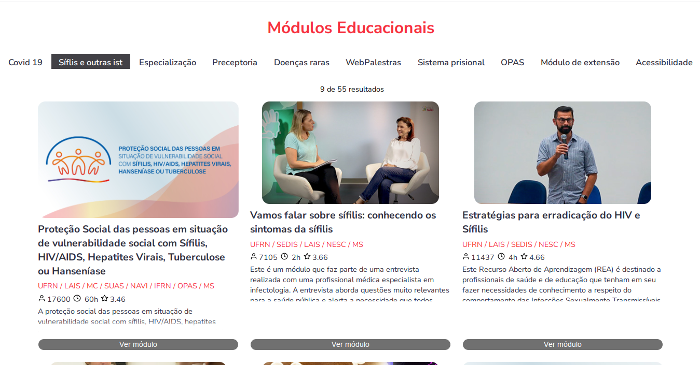

- [x] CA#02: Ordenar e filtrar os módulos educacionais em suas categorias.

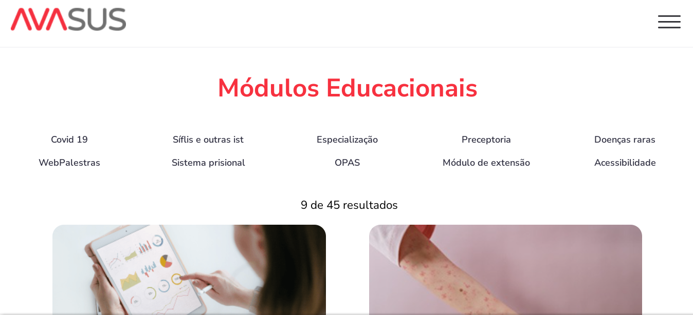

- [x] CA#03: A listagem deve ser paginada.

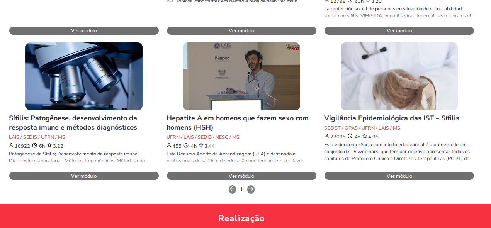

- [x] CA#04: Exibir total de módulos e a quantidade de módulos mostrados no momento.

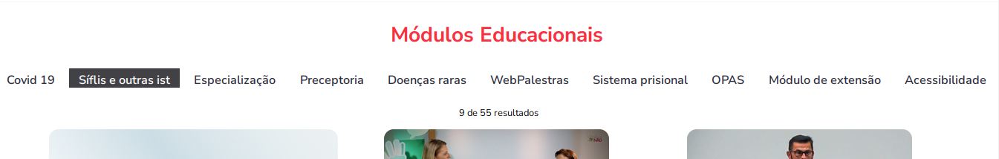

- ### História Usuário #3 - Página de informação sore o módulo educacional:

#### Visualizar informações específicas sobre um determinado módulo educacional.

- [x] CA#01: Exibir um cabeçalho com o nome, parceiros e imagem de capa do módulo educacional.

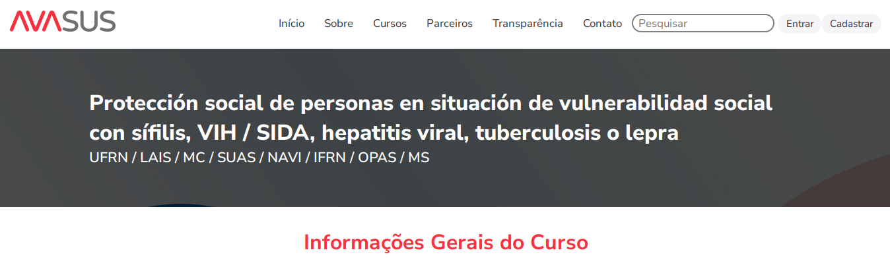

- [x] CA#02: Exibir seções de informações gerais, sobre o curo, objetivos, recursos educacionais e créditos.

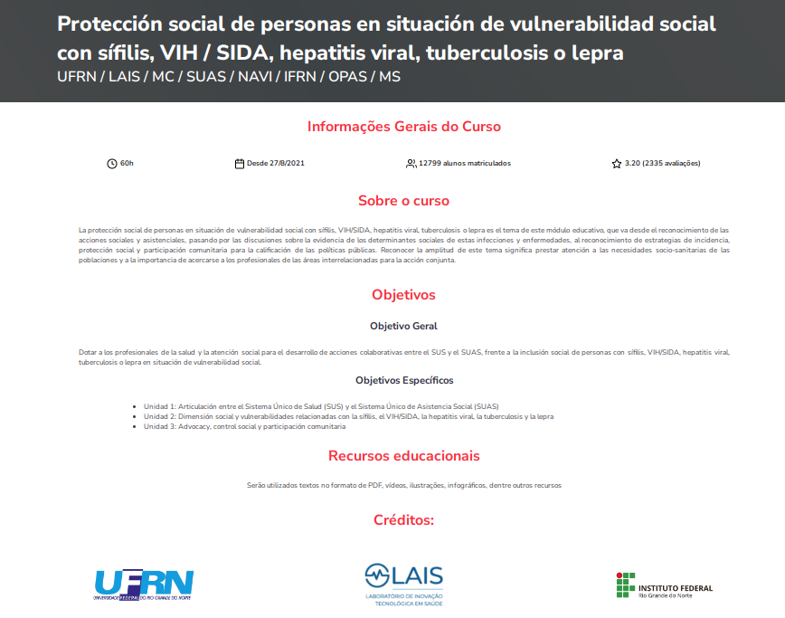

- ### História Usuário #4 - Página de listagem dos parceiros:

#### Poder viualizar a listagem de todos os parceiros.

- [x] CA#01: A listagem deve ser paginada.

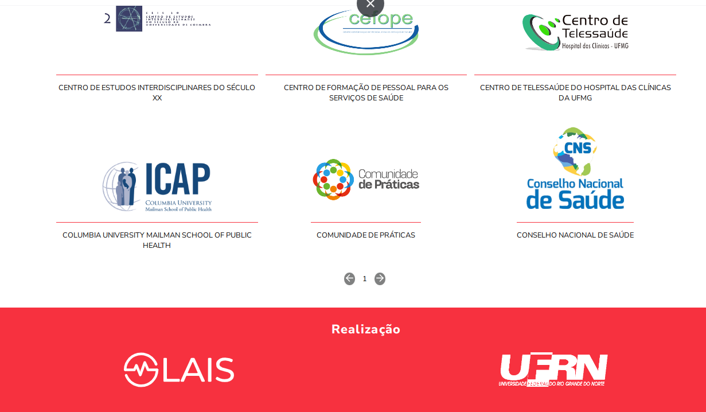

- [x] CA#02: Exibir total de parceiros e a quantidade de parceiros mostrado no momento.

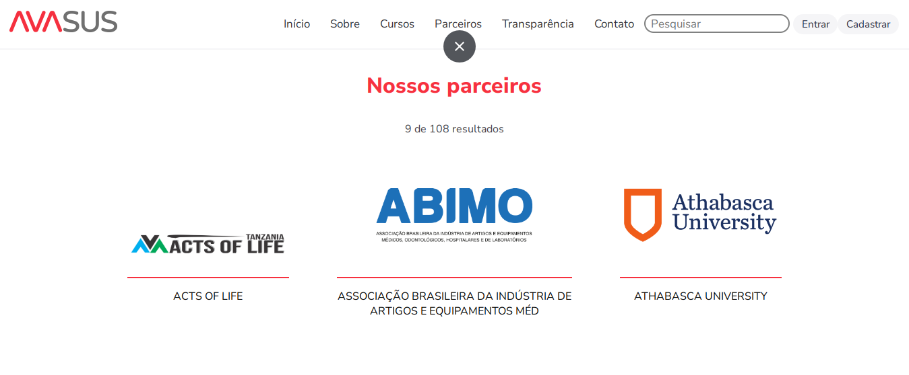

- ### História Usuário #5 - Página de transparência:

#### Visualizar dados de transparência sobre os usuários e os módulos educacionais do sistema.

- [x] CA#01: Exibição de dados gerais.

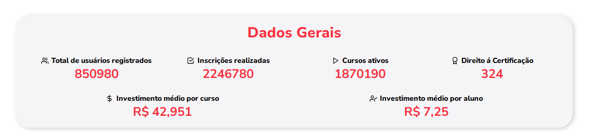

- [ ] CA#02: Mapa interativo com usuários por estado.

- [x] CA#03: Gráfio de usuários por curso.

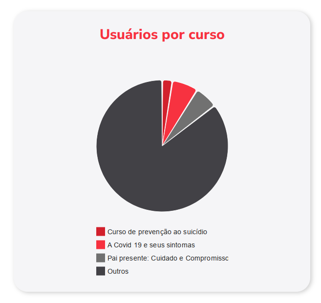

- [x] CA#04: Todos os dados devem ser recuperados da API.
 
## Ferramentas utilizadas:

